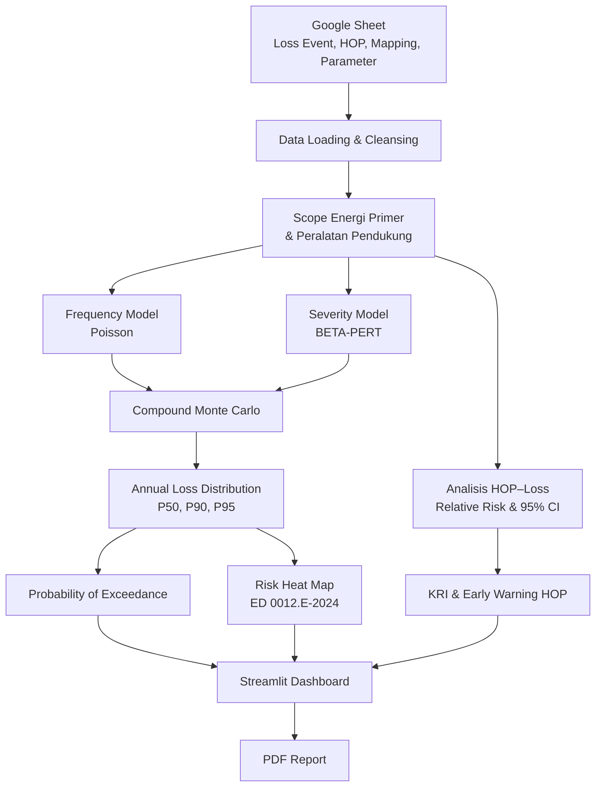

## Arsitektur Logis PRIME-RISK

PRIME-RISK mengolah data historis HOP dan kejadian loss dalam
scope hambatan energi primer batubara dan peralatan pendukungnya.

### Komponen Model

| Lapisan | Fungsi |
|---|---|
| Data source | Google Sheet berisi Loss Event, HOP harian, mapping unit, dan parameter model |
| Data pipeline | Membaca, membersihkan, memetakan, dan menentukan scope data |
| Frequency model | Mengestimasi frekuensi kejadian menggunakan distribusi Poisson |
| Severity model | Mengestimasi dampak setiap kejadian menggunakan BETA-PERT |
| Monte Carlo | Membentuk distribusi total kerugian dari kombinasi frekuensi dan severity |
| Risk analytics | Menghasilkan P50, P90, P95, PoE, Relative Risk, dan risk heat map |
| Reporting | Menyajikan hasil melalui dashboard Streamlit dan laporan PDF |

### Prinsip Pemodelan

- Satu baris pada `Loss_Event_Detail_v2` merepresentasikan satu kejadian loss.
- Scope model dibatasi pada hambatan energi primer batubara dan peralatan pendukung.
- Frekuensi kejadian dimodelkan menggunakan distribusi Poisson.
- Severity dimodelkan menggunakan distribusi BETA-PERT.
- Total annual loss dibentuk melalui simulasi Monte Carlo.
- Risk Limit dibaca dari sheet `Parameter_Model`.
- Nilai HOP negatif diperlakukan sebagai nol pada layer pemrosesan tanpa mengubah data sumber.
- Hasil model merupakan estimasi probabilistik, bukan kepastian kejadian.
